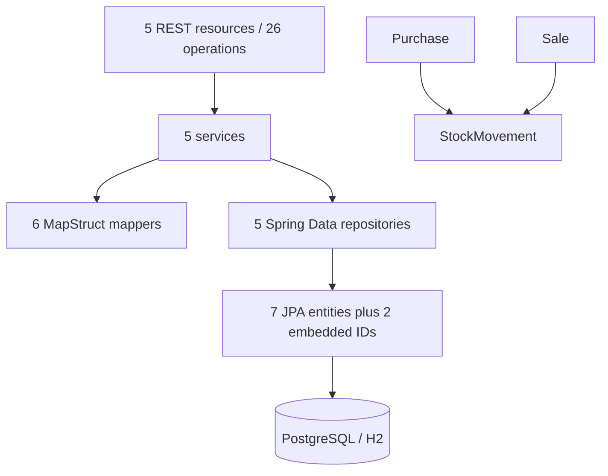

# Repository Profile

## Snapshot

| Field | Observed value |
| --- | --- |
| Repository | `ozkanogus/SpringBootSampleERP` |
| Analyzed revision | `d4efa460aed4f697b9333d42898b4e388a23cfb3` |
| Build | Maven, single-module JAR |
| Language target | Java 17 (verified with Temurin 17.0.20.1) |
| Framework | Spring Boot 3.5.16 (Stage 3e verified) |
| Application entry point | `tr.com.erpsample.grocery.GroceryApp` |
| Runtime database | PostgreSQL |
| Test database | H2 |
| Production Java files | 53 |
| Test classes / invocations | 13 / 46 (30 default plus 16 opt-in PostgreSQL cases) |
| CI | None found |
| Containers | None found |

## Project history and modernization posture

The owner developed this repository approximately four to five years before the
2026 modernization effort for a real wholesale grocery market. Development ended
because of a budget cut, the product remained incomplete, and it was never
deployed. The source was subsequently published in the owner's personal GitHub
account.

This lowers production migration risk: there are no live consumers, production
data, or operational service-level commitments to preserve. It does not remove
the need for disciplined changes. Purchase, sale, product, grocery, inventory,
and reporting behavior encode real domain intent and should be characterized
before substantial redesign.

Modernization may therefore include defect correction and feature completion in
addition to technical upgrades. When the existing code is ambiguous, record the
assumption, define the intended business rule in a test or decision note, and
keep behavioral work separate from mechanical framework migration.

## Business and architectural shape

The application is a layered grocery ERP REST backend:

Primary aggregates and concepts are `Grocery`, `Product`, `Purchase`, `Sale`,
and `StockMovement`. Purchase and sale line items use association entities with
embedded identifiers. Purchase and sale services create corresponding stock
movements; this is a behavior-sensitive modernization seam.

## Interfaces

Five Spring MVC resources expose CRUD endpoints below `/api` for groceries,
products, purchases, sales, and stock movements. Sales additionally expose a
top-three-products query scoped by grocery. DTOs and MapStruct mappers separate
web/service payloads from most entities.

No authentication or authorization layer was found. No messaging or scheduled
job integration was found. Actuator and Springdoc dependencies are present.

## Persistence and configuration

- Spring Data JPA with Hibernate and HikariCP.
- PostgreSQL is configured for local runtime; H2 is configured for tests.
- `spring.jpa.hibernate.ddl-auto=update` is present for the runtime profile.
- Liquibase properties are enabled by the application class, but no changelog
  or migration files and no Liquibase dependency were found.
- A local database password is committed in the default properties. Treat it only as
  a disposable local default and replace it with external configuration during
  hardening.
- Open Session in View is disabled.

## Build and dependency observations

- The Spring Boot parent/property are now `3.5.16`, after the Jakarta checkpoint.
  Java 17 is unchanged. See `BOOT35_RESULT.md` for current evidence;
  the original dependency observations below are historical discovery evidence.
- The POM declares Java 17 and Maven 3.3.9.
- The original configured start class used `groceryApp` instead of `GroceryApp`.
  This was corrected after a post-packaging regression test reproduced the
  manifest mismatch; the test now verifies that the manifest targets packaged classes.
- The Maven wrapper was restored with wrapper 3.3.4, Maven 3.9.16, and an
  executable Unix launcher during baseline repair.
- The POM includes both managed and explicit framework components, including
  Hibernate, Jackson modules, MapStruct 1.4.2.Final, Lombok 1.18.22,
  Problem Spring Web 0.27.0, Springdoc 1.6.5, and Testcontainers 1.16.2.
- The Testcontainers PostgreSQL dependency is declared with `provided` scope in
  the main dependency set and appears again in a profile; its intent should be
  clarified during build cleanup.

## Modernization pressure points

1. **Reproducibility:** keep the restored Maven wrapper, verified Java 17
   toolchain, and green `clean verify` baseline as the canonical build entry.
2. **Safety net:** characterize REST contracts, persistence mappings, startup,
   error handling, and purchase/sale stock effects.
3. **Domain completion:** identify missing wholesale workflows and distinguish
   deliberate scope from abandoned implementation before expanding the model.
4. **Spring Boot 3 boundary:** the original 81 production javax imports were
   migrated to Jakarta. All approved Boot 3 checkpoints through 3.5 pass.
5. **Database evolution:** replace schema auto-update with an explicit,
   versioned migration strategy after capturing the current schema behavior.
6. **Configuration:** externalize credentials and define clear local/test
   profiles without changing defaults accidentally.
7. **Dependency cleanup:** remove redundant or misplaced declarations only after
   the baseline is green and each change can be verified.
8. **Automation:** add CI after the canonical build command is reproducible.

## Recommended next phase

Stages 1 and 2 are green. Reporting, single-line service workflows, replacement,
deletion cascades, surrounding and service-owned failure rollback, and selected
full-context HTTP contracts pass. Review residual gaps in `POSTGRES_TESTS.md`
and the exact dependency compatibility plan before approving Stage 3.

## Discovery limits

This profile is based on static inspection plus baseline commands. Production
compilation, dependency resolution, thirty tests, and JAR packaging are
verified. H2 schema creation and selected persistence mappings are exercised;
the Spring context loads with demo-data generation mocked out. A separate manual
PostgreSQL 18.6 smoke test verified packaged startup, demo-data creation, list
endpoints, native report execution, and OpenAPI availability. See
`POSTGRES_SMOKE_TEST.md` for evidence and limits. Four deterministic PostgreSQL
reporting tests now pass; see `POSTGRES_TESTS.md` for scope and remaining gaps.
