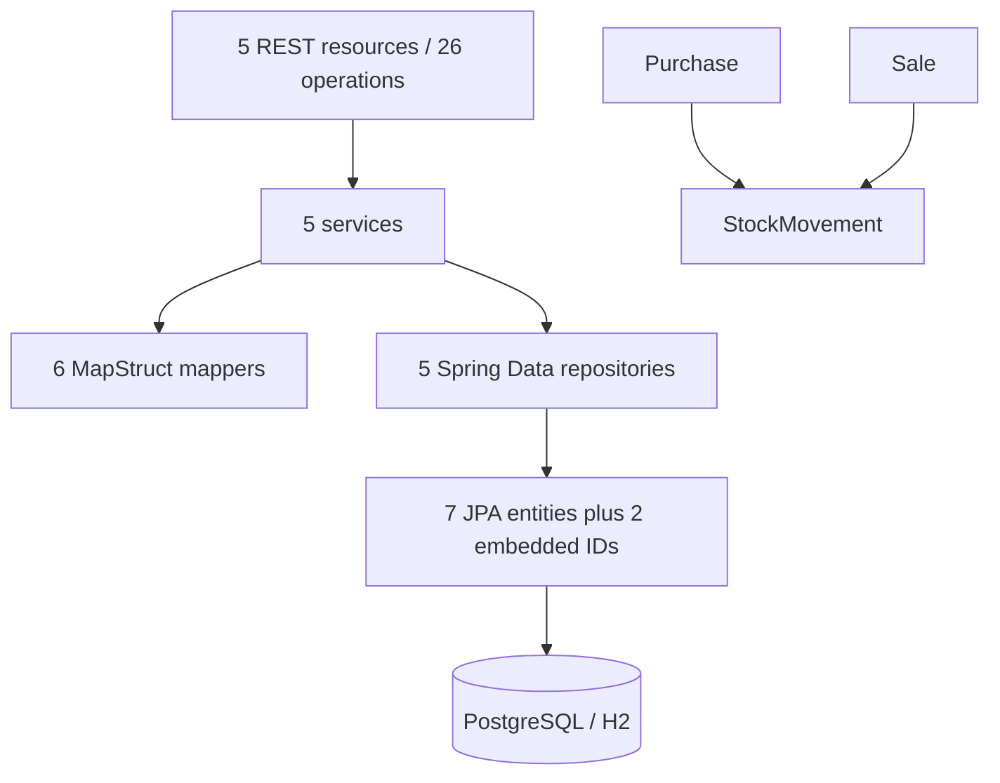

# Repository Profile

## Snapshot

| Field | Observed value |
| --- | --- |
| Repository | `ozkanogus/SpringBootSampleERP` |
| Analyzed revision | `d4efa460aed4f697b9333d42898b4e388a23cfb3` |
| Build | Maven, single-module JAR |
| Language target | Java 17 (verified with Temurin 17.0.20.1) |
| Framework | Spring Boot 2.6.3 |
| Application entry point | `tr.com.erpsample.grocery.GroceryApp` |
| Runtime database | PostgreSQL |
| Test database | H2 |
| Production Java files | 53 |
| Test classes / methods | 4 / 9 |
| CI | None found |
| Containers | None found |

## Business and architectural shape

The application is a layered grocery ERP REST backend:

Primary aggregates and concepts are `Grocery`, `Product`, `Purchase`, `Sale`,
and `StockMovement`. Purchase and sale line items use association entities with
embedded identifiers. Purchase and sale services create corresponding stock
movements; this is a behavior-sensitive modernization seam.

## Interfaces

Five Spring MVC resources expose CRUD endpoints below `/api` for groceries,
products, purchases, sales, and stock movements. Sales additionally expose a
top-three-products query scoped by grocery. DTOs and MapStruct mappers separate
web/service payloads from most entities.

No authentication or authorization layer was found. No messaging or scheduled
job integration was found. Actuator and Springdoc dependencies are present.

## Persistence and configuration

- Spring Data JPA with Hibernate and HikariCP.
- PostgreSQL is configured for local runtime; H2 is configured for tests.
- `spring.jpa.hibernate.ddl-auto=update` is present for the runtime profile.
- Liquibase properties are enabled by the application class, but no changelog
  or migration files and no Liquibase dependency were found.
- A local database password is committed in the default properties. Treat it only as
  a disposable local default and replace it with external configuration during
  hardening.
- Open Session in View is disabled.

## Build and dependency observations

- The Spring Boot parent and explicit Spring Boot property are both `2.6.3`.
- The POM declares Java 17 and Maven 3.3.9.
- The configured start class uses `groceryApp`, while the actual class is
  `GroceryApp`; case-sensitive packaging should verify this before migration.
- The Maven wrapper was restored with wrapper 3.3.4, Maven 3.9.16, and an
  executable Unix launcher during baseline repair.
- The POM includes both managed and explicit framework components, including
  Hibernate, Jackson modules, MapStruct 1.4.2.Final, Lombok 1.18.22,
  Problem Spring Web 0.27.0, Springdoc 1.6.5, and Testcontainers 1.16.2.
- The Testcontainers PostgreSQL dependency is declared with `provided` scope in
  the main dependency set and appears again in a profile; its intent should be
  clarified during build cleanup.

## Modernization pressure points

1. **Reproducibility:** keep the restored Maven wrapper, verified Java 17
   toolchain, and green `clean verify` baseline as the canonical build entry.
2. **Safety net:** characterize REST contracts, persistence mappings, startup,
   error handling, and purchase/sale stock effects.
3. **Spring Boot 3 boundary:** 81 production imports use `javax.*`; moving to
   Boot 3 requires a coordinated Jakarta migration and compatible library lines.
4. **Database evolution:** replace schema auto-update with an explicit,
   versioned migration strategy after capturing the current schema behavior.
5. **Configuration:** externalize credentials and define clear local/test
   profiles without changing defaults accidentally.
6. **Dependency cleanup:** remove redundant or misplaced declarations only after
   the baseline is green and each change can be verified.
7. **Automation:** add CI after the canonical build command is reproducible.

## Recommended next phase

Add targeted characterization tests around behavior-sensitive seams, then
prepare an approved migration plan with small compatibility checkpoints. Do not
combine safety-net work with the Spring Boot upgrade.

## Discovery limits

This profile is based on static inspection plus baseline commands. Production
compilation, dependency resolution, the nine existing tests, and JAR packaging
are verified. Runtime behavior, generated schema, PostgreSQL integration, and
OpenAPI output remain unverified.
