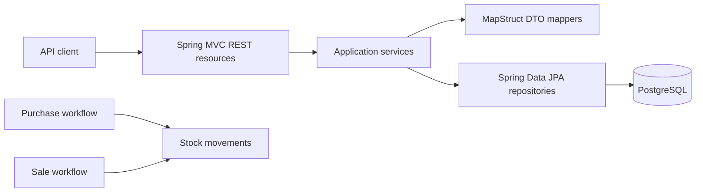

# WholesaleFlow ERP

WholesaleFlow ERP is a wholesale operations backend for managing grocery
locations, products, purchasing, sales, and the stock movements produced by
commercial transactions.

The product began as a system for a real wholesale grocery market. Development
stopped after a budget cut before the original implementation was completed or
deployed. It contains no production data or live-service compatibility
commitments, and development now continues as an independently maintained
business application.

> The repository also records a completed technical modernization using the
> [Agentic Java Modernization](https://github.com/ozkanogus/agentic-java-modernization)
> methodology. Its verified checkpoint is Java 21 and Spring Boot 4.0.8.
> Product completion and production readiness remain separate ongoing work.

## System at a glance



The API is rooted at `/api` and provides CRUD operations for:

- `/groceries`
- `/products`
- `/purchases`
- `/sales`
- `/stockMovements`

It also exposes `GET /api/sales/topSold/{groceryId}`.

Error bodies use application/problem+json with application-owned compatibility
fields. Validation errors include field/message violations; unexpected 500 errors
omit internal diagnostic details. Missing entities return empty 404 responses.

This report ranks current-calendar-month quantities for one grocery, returning
at most three products, with product ID ascending as the tie-breaker. Month
selection follows the PostgreSQL session timezone. See
[PostgreSQL test setup](.modernization/POSTGRES_TESTS.md) for opt-in report tests.

## Technology baseline

- Java 21 is declared in Maven (verified with Temurin 21.0.12.1).
- Spring Boot 4.0.8 (verified migration checkpoint; deployment hardening remains)
- Maven
- Spring MVC and embedded Tomcat
- Spring Data JPA and Hibernate
- Flyway 11.14.1 for versioned PostgreSQL schema migrations
- PostgreSQL for local runtime; H2 is configured for tests
- MapStruct and Lombok
- Springdoc OpenAPI UI

## Running locally

Use a Java 21 JDK and the committed Maven wrapper. Set `JAVA_HOME` to your JDK
installation and select the same JDK for your IDE project and Maven runner.
The local side-by-side installation used for verification is
`/Users/ozkanogus/.local/opt/temurin-21`; no global Java setting was changed.

```bash
export JAVA_HOME=/Users/ozkanogus/.local/opt/temurin-21
./mvnw clean verify
```

Java 17 remains available for rebuilding the previous checkpoint, but cannot run
the Java 21-targeted artifact. See [Java 21 verification](.modernization/JAVA21_RESULT.md).

Before running, supply `SPRING_DATASOURCE_URL`, `SPRING_DATASOURCE_USERNAME`, and
`SPRING_DATASOURCE_PASSWORD` through your environment or secret manager, then run
`./mvnw spring-boot:run`. No runtime connection credentials are bundled. The
application listens on port `8082` unless `SERVER_PORT` overrides it.

Demo data is disabled by default. Set `GROCERY_DEMO_DATA_ENABLED=true` only for
an isolated disposable database to opt in to the existing random sample data.
The initializer is not a migration tool or a reliable repair of partially seeded
data. Keep it disabled for real data. Tests use isolated settings and explicit
fixtures; no local PostgreSQL password is needed for the default build.

Flyway applies immutable migrations from `src/main/resources/db/migration` before
Hibernate validates the schema. A new empty database is created by V1. Existing
non-empty databases without Flyway history intentionally fail startup; follow the
reviewed adoption procedure in `.modernization/FLYWAY_RESULT.md` and never enable
automatic baselining. `.env` files are ignored by Git but are not automatically loaded by Spring
Boot. Do not commit passwords. Previously committed credentials remain in Git
history and must be rotated anywhere they were reused.

## Tests

GitHub Actions runs both commands below on Temurin 21. The PostgreSQL job starts
an empty PostgreSQL 18 service so Flyway V1 and Hibernate validation are exercised.
The workflow is locally validated; its first hosted run requires these commits to
be pushed. It does not deploy or publish artifacts.

The default build runs 44 tests across 14 unit, MVC, persistence, context,
server and packaging test classes:

- `GroceryServiceTest`
- `ProductServiceTest`
- `PurchaseServiceTest`
- `SaleServiceTest`
- `StockMovementServiceTest`
- `GroceryResourceTest`
- `GroceryHttpTest`
- `PersistenceMappingTest`
- `GroceryContextTest`
- `WebServerTest`
- `ErrorAdviceContractTest`
- `ResourceLookupHttpTest`
- `DataPopulatorConfigurationTest`
- `PackagedApplicationIT` (runs after packaging during `verify`)

The verified wrapper baseline compiles the application, runs all 44 default
tests, and packages the executable JAR. The PostgreSQL profile adds 16 tests
(60 total across 16 classes). See `.modernization/TEST_BASELINE.md`
for the exact result and current test gaps.

## Product and modernization status

Discovery findings are recorded in
`.modernization/REPOSITORY_PROFILE.md`. The build baseline is reproducible;
the Boot 4.0 checkpoint is verified in `.modernization/BOOT40_RESULT.md`.
Hosted CI confirmation, authentication/authorization, deployment design, broader
domain coverage, and unfinished wholesale workflows remain. Because the original
application never entered production, incomplete behavior may be completed and
verified defects corrected, but each change should document its intended business
rule and remain reviewable.

## Contributing

Read `AGENTS.md` before making changes. Keep modernization work incremental,
preserve observable behavior, and separate baseline repairs from framework or
dependency upgrades.
