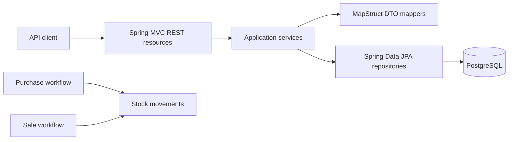

# SpringBootSampleERP

SpringBootSampleERP is a sample grocery ERP backend built with Spring Boot. It
manages groceries, products, purchases, sales, and the stock movements produced
by purchase and sale operations.

The code began several years ago as an unfinished application for a real
wholesale grocery market. Budget constraints ended development before deployment,
so it never went live and has no production data or production compatibility
commitments. The repository now serves as both a modernization case study and a
foundation that may be corrected and completed.

> This repository is being used as a pilot for the
> [Agentic Java Modernization](https://github.com/ozkanogus/agentic-java-modernization)
> methodology. The current phase documents the existing system; it does not yet
> change application behavior or dependencies.

## System at a glance



The API is rooted at `/api` and provides CRUD operations for:

- `/groceries`
- `/products`
- `/purchases`
- `/sales`
- `/stockMovements`

It also exposes `GET /api/sales/topSold/{groceryId}`.

## Technology baseline

- Java 17 is declared in Maven (a local JDK is required).
- Spring Boot 2.6.3
- Maven
- Spring MVC and Undertow
- Spring Data JPA and Hibernate
- PostgreSQL for local runtime; H2 is configured for tests
- MapStruct and Lombok
- Springdoc OpenAPI UI

## Running locally

Use a Java 17 JDK and the committed Maven wrapper:

```bash
./mvnw clean verify
./mvnw spring-boot:run
```

The default application configuration expects PostgreSQL at
`jdbc:postgresql://localhost:5432/grocery` and listens on port `8082`.
Review `src/main/resources/config/application.properties` before running;
local credentials should be supplied outside version control.

## Tests

Ten test classes contain twenty-nine unit, MVC, persistence, and context tests:

- `GroceryServiceTest`
- `ProductServiceTest`
- `PurchaseServiceTest`
- `SaleServiceTest`
- `StockMovementServiceTest`
- `GroceryResourceTest`
- `GroceryHttpTest`
- `PersistenceMappingTest`
- `GroceryContextTest`
- `ResourceLookupHttpTest`

The verified wrapper baseline compiles the application, runs all twenty-nine
tests, and packages the executable JAR. See `.modernization/TEST_BASELINE.md`
for the exact result and current test gaps.

## Modernization status

Discovery findings are recorded in
`.modernization/REPOSITORY_PROFILE.md`. The build baseline is reproducible;
characterization and migration planning come next. Because the application never
entered production, verified defects and incomplete behavior may be corrected,
but each change should document its intended business rule and remain reviewable.

## Contributing

Read `AGENTS.md` before making changes. Keep modernization work incremental,
preserve observable behavior, and separate baseline repairs from framework or
dependency upgrades.
