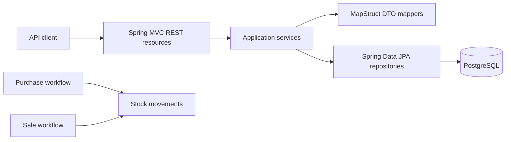

# SpringBootSampleERP

SpringBootSampleERP is a sample grocery ERP backend built with Spring Boot. It
manages groceries, products, purchases, sales, and the stock movements produced
by purchase and sale operations.

> This repository is being used as a pilot for the
> [Agentic Java Modernization](https://github.com/ozkanogus/agentic-java-modernization)
> methodology. The current phase documents the existing system; it does not yet
> change application behavior or dependencies.

## System at a glance



The API is rooted at `/api` and provides CRUD operations for:

- `/groceries`
- `/products`
- `/purchases`
- `/sales`
- `/stockMovements`

It also exposes `GET /api/sales/topSold/{groceryId}`.

## Technology baseline

- Java 17 is declared in Maven (a local JDK is required).
- Spring Boot 2.6.3
- Maven
- Spring MVC and Undertow
- Spring Data JPA and Hibernate
- PostgreSQL for local runtime; H2 is configured for tests
- MapStruct and Lombok
- Springdoc OpenAPI UI

## Running locally

The committed Maven wrapper is currently incomplete and not executable on
Unix-like systems. Until that is repaired, use a local Java 17 JDK and Maven:

```bash
mvn clean verify
mvn spring-boot:run
```

The default application configuration expects PostgreSQL at
`jdbc:postgresql://localhost:5432/grocery` and listens on port `8082`.
Review `src/main/resources/config/application.properties` before running;
local credentials should be supplied outside version control.

## Tests

Four service test classes contain nine Mockito-based unit tests:

- `GroceryServiceTest`
- `ProductServiceTest`
- `PurchaseServiceTest`
- `SaleServiceTest`

The baseline cannot currently be executed on the analyzed machine because no
JDK is installed and the Maven wrapper metadata is absent. See
`.modernization/TEST_BASELINE.md` for the exact result and current test gaps.

## Modernization status

Discovery findings are recorded in
`.modernization/REPOSITORY_PROFILE.md`. Dependency upgrades, Jakarta namespace
changes, and production-code edits are intentionally deferred until the build
baseline is reproducible and a migration plan is approved.

## Contributing

Read `AGENTS.md` before making changes. Keep modernization work incremental,
preserve observable behavior, and separate baseline repairs from framework or
dependency upgrades.
