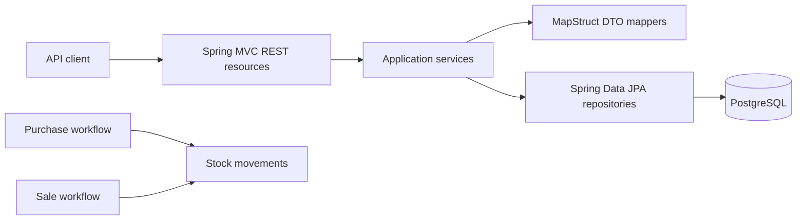

# SpringBootSampleERP

SpringBootSampleERP is a sample grocery ERP backend built with Spring Boot. It
manages groceries, products, purchases, sales, and the stock movements produced
by purchase and sale operations.

The code began several years ago as an unfinished application for a real
wholesale grocery market. Budget constraints ended development before deployment,
so it never went live and has no production data or production compatibility
commitments. The repository now serves as both a modernization case study and a
foundation that may be corrected and completed.

> This repository is being used as a pilot for the
> [Agentic Java Modernization](https://github.com/ozkanogus/agentic-java-modernization)
> methodology. The verified checkpoint is Spring Boot 4.0.8 with native MVC
> error handling. Further framework upgrades require separate verification.

## System at a glance



The API is rooted at `/api` and provides CRUD operations for:

- `/groceries`
- `/products`
- `/purchases`
- `/sales`
- `/stockMovements`

It also exposes `GET /api/sales/topSold/{groceryId}`.

Error bodies use application/problem+json with application-owned compatibility
fields. Validation errors include field/message violations; unexpected 500 errors
omit internal diagnostic details. Missing entities return empty 404 responses.

This report ranks current-calendar-month quantities for one grocery, returning
at most three products, with product ID ascending as the tie-breaker. Month
selection follows the PostgreSQL session timezone. See
[PostgreSQL test setup](.modernization/POSTGRES_TESTS.md) for opt-in report tests.

## Technology baseline

- Java 21 is declared in Maven (verified with Temurin 21.0.12.1).
- Spring Boot 4.0.8 (verified migration checkpoint; deployment hardening remains)
- Maven
- Spring MVC and embedded Tomcat
- Spring Data JPA and Hibernate
- PostgreSQL for local runtime; H2 is configured for tests
- MapStruct and Lombok
- Springdoc OpenAPI UI

## Running locally

Use a Java 21 JDK and the committed Maven wrapper. Set `JAVA_HOME` to your JDK
installation and select the same JDK for your IDE project and Maven runner.
The local side-by-side installation used for verification is
`/Users/ozkanogus/.local/opt/temurin-21`; no global Java setting was changed.

```bash
export JAVA_HOME=/Users/ozkanogus/.local/opt/temurin-21
./mvnw clean verify
```

Java 17 remains available for rebuilding the previous checkpoint, but cannot run
the Java 21-targeted artifact. See [Java 21 verification](.modernization/JAVA21_RESULT.md).

Before running, supply `SPRING_DATASOURCE_URL`, `SPRING_DATASOURCE_USERNAME`, and
`SPRING_DATASOURCE_PASSWORD` through your environment or secret manager, then run
`./mvnw spring-boot:run`. No runtime connection credentials are bundled. The
application listens on port `8082` unless `SERVER_PORT` overrides it.

Demo data is disabled by default. Set `GROCERY_DEMO_DATA_ENABLED=true` only for
an isolated disposable database to opt in to the existing random sample data.
The initializer is not a migration tool or a reliable repair of partially seeded
data. Keep it disabled for real data. Tests use isolated settings and explicit
fixtures; no local PostgreSQL password is needed for the default build.

Schema auto-update is still a known limitation, pending versioned migrations.
Use `SPRING_JPA_HIBERNATE_DDL_AUTO=validate` with a prepared schema for safe runtime
checks. `.env` files are ignored by Git but are not automatically loaded by Spring
Boot. Do not commit passwords. Previously committed credentials remain in Git
history and must be rotated anywhere they were reused.

## Tests

The default build runs 44 tests across 14 unit, MVC, persistence, context,
server and packaging test classes:

- `GroceryServiceTest`
- `ProductServiceTest`
- `PurchaseServiceTest`
- `SaleServiceTest`
- `StockMovementServiceTest`
- `GroceryResourceTest`
- `GroceryHttpTest`
- `PersistenceMappingTest`
- `GroceryContextTest`
- `WebServerTest`
- `ErrorAdviceContractTest`
- `ResourceLookupHttpTest`
- `DataPopulatorConfigurationTest`
- `PackagedApplicationIT` (runs after packaging during `verify`)

The verified wrapper baseline compiles the application, runs all 44 default
tests, and packages the executable JAR. The PostgreSQL profile adds 16 tests
(60 total across 16 classes). See `.modernization/TEST_BASELINE.md`
for the exact result and current test gaps.

## Modernization status

Discovery findings are recorded in
`.modernization/REPOSITORY_PROFILE.md`. The build baseline is reproducible;
the Boot 4.0 checkpoint is verified in `.modernization/BOOT40_RESULT.md`.
Deployment hardening and broader domain coverage remain. Because the application never
entered production, verified defects and incomplete behavior may be corrected,
but each change should document its intended business rule and remain reviewable.

## Contributing

Read `AGENTS.md` before making changes. Keep modernization work incremental,
preserve observable behavior, and separate baseline repairs from framework or
dependency upgrades.
